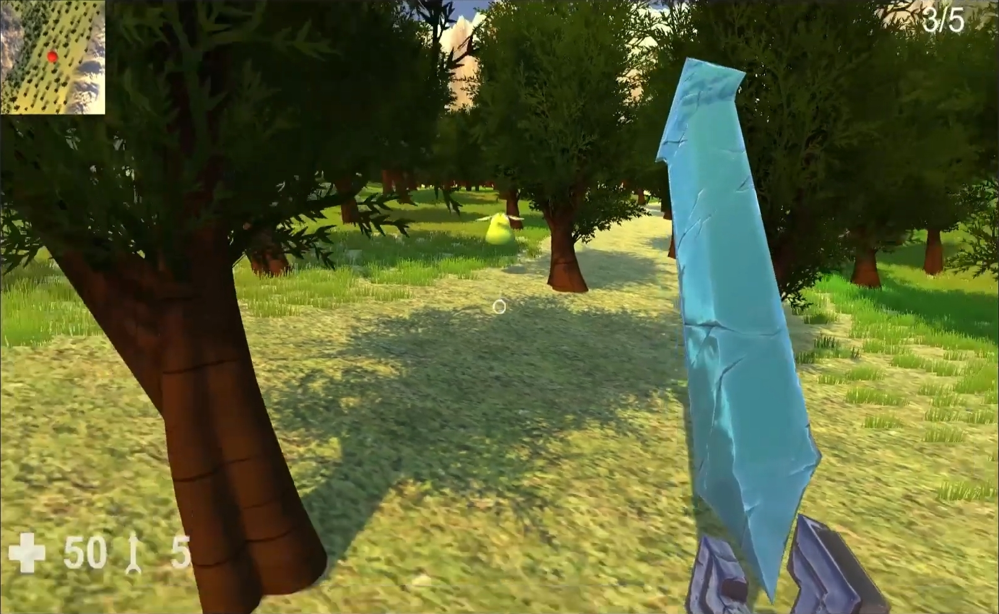

<h1>Fruit Challenge</h1>

This is the first mini game that I did while I was studying the Higher Technichal Certificate,
This project was created for learning purposes.

If you wanna test it you can play it.
<h2>Controls</h2>
Numbers: 1 - 5 Its for diferent weapons. 
Move: w-a-s-d. 
Sprint: shift. 
Jump: space. 
Close: alt-f4, (yep when I did this project I forget about it). 
<h2>Objective</h2>
Find and take all hiden fruits (5)

<h2>Image</h2>

